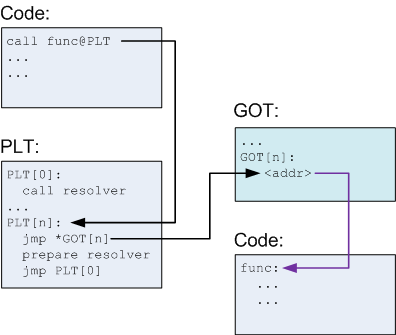
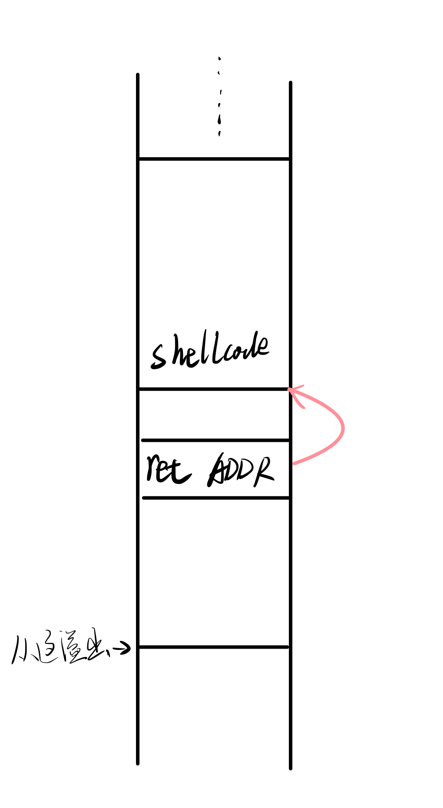
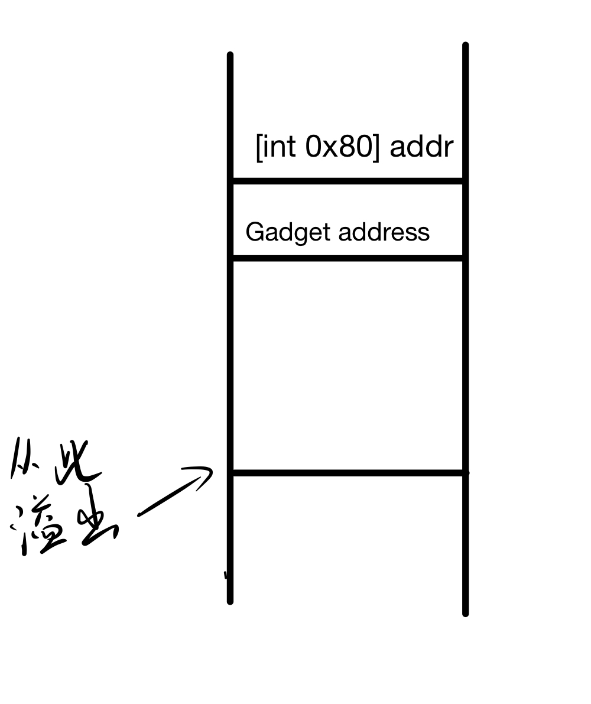
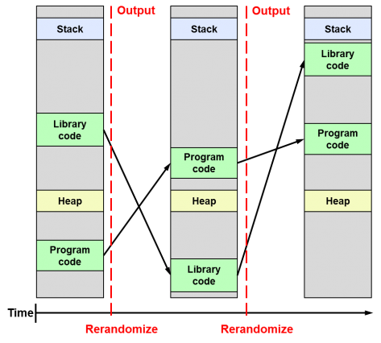

# HMH_STUDY

## 2023.7.13

complete git config on docker-ubuntu, successfully access to remote git repository 11:08
learning to read assambly code

## 2023.7.17

完成linux中elf格式和x86汇编和指令集的学习
学会IDA和gdb的基本使用

## 2023.7.18

* `.text节、.data节等是什么意思?`

    .text节 elf文件中的程序代码所在的节，可读可执行但不可写
    .data节 elf文件中已初始化的程序全局变量或静态变量所在的节，可读写
* `在一个典型的C/C++程序中，全局变量、栈变量、堆变量，在汇编语言层面是如何体现的?`

  * 全局变量：已初始化的存放在.data，未初始化的存放在.bss，在代码段被使用。
  * 堆变量：调用new,malloc等库函数,再由库函数调用system call在内存上分配空间，参数为需要分配的字节数(编译器自行计算)。且必须销毁！（会先检查是否为空指针，若不是才进行销毁）

        *注意：int* ptr = new int[5];中的ptr是局部变量，栈变量，new出来的数组才是放在堆里的。
  * 栈变量：程序中的局部变量或部分函数参数，存放在栈中。每个函数都自己的帧，由栈底指针确定当前栈。以小端系统为例，栈顶指针增回收栈，减扩容栈，push压栈并减，pop弹栈并增。一般通过栈底指针加偏移量取值(栈底指针较稳定)。在x86-64中栈底指针通常存放在rbp，栈顶指针存放在rsp。(risc-v的fp,sp)。
    </br><font color=grey>*注意：一个函数中的所有局部变量(non-static)都会在函数一开始为他们在栈上分配空间*</font>
* `ELF程序的节的权限是什么意思，例如，什么是可读、可写、可执行等?`

    节的权限是指在程序运行时对节的操作权限。

    可读，通常的elf所有节都是可读的，但也可以手动更改设为不可读。
    可写，如.bss节, .data节，可以对节的内容进行修改
    可执行，如.text节(程序的代码段)。
* `ELF程序中，符号是什么意思，调试信息是什么意思，字符串、符号、调试信息有什么区别?`

  * 符号（Symbols）是与程序中的函数、变量或其他实体相关联的标识符。
    * 有三种类型（c/c++为例）:
      * global symbol 没被static修饰的全局变量，外部文件可引用
      * external symbol 引用的定义在别的文件中的global symbol
      * local symbol 被static修饰的全局变量，只在本文件中可被引用

    * 强弱之分：已初始化的为强符号，反之为弱。对符号引用和符号定义连接的过程会有影响：
      * 不能有同名的强符号，会error
      * 同名的强符号和弱符号，linker选强符号
      * 同名的弱符号，linker随机选择一个  

  * 调试信息是是与程序执行相关的附加数据，用于在调试和分析程序时提供更多的上下文和信息。调试信息包含有关源代码文件、行号、变量名称、类型信息和编译器生成的其他调试相关信息。这些信息有助于调试器和其他工具在源代码级别进行调试和分析。gcc/g++中带参数-g生成可调试的可执行文件.out
  * 字符串是一种数据类型，用于存储文本数据，通常用于表示符号名称、文件路径和调试信息中的文本

* `x86-64寄存器`

    常用的有：
  * `rax` 常用作函数返回值
  * `rsp`栈顶指针
  * `rbp` 栈底指针
  * `rdi,rsi,rdx,rcx` 常用作入参数
  * `rip` 指令指针寄存器
  * `r8~r15` 通用寄存器
  * `rflags` 标识寄存器
        </br>该寄存器中有许多位，分别作为不同的标志。常用的有
        CF： 进位标志，PF ： 奇偶标志，ZF ： 零标志，SF ： 符号标志，OF ： 补码溢出标志，TF： 跟踪标志，IF ： 中断标志

    </br>
* `常见寻址模式在汇编语言中的表现形式`
  * 直接寻址 `mov rax, QWORD PTR [0x007]`
  * 立即数寻址 `mov rdi,0x0`
        </br>$\quad$ 常见于：
    * 局部变量赋值

        ``` c++
            int a = 0; 
        ```

    * for,if的数值大小判断

        ``` c++
            if (c<10)
        ```

    * 栈的扩容和回收

         ``` amd64
            sub rsp,32
        ```

  * 寄存器寻址 `mov rdi,rax`
  * 寄存器相对寻址 `mov DWORD PTR -16[rbp],edi`
        </br>$\quad$ 常见于：
    * 局部变量的赋值和引用（即使用栈）

         ```  c++
            int a=5; 
            a=c;
            delete ptr;
         ```

    * 访问结构体或类对象的成员

        ```  c++
          Human jack;
          jack.id =1;
        ```

  * rip-relative `lea rax, .LC0[rip]` .LC0是字符串相对于rip的偏移量，是PIC
    </br>$\quad$ 常见于：
    * 对全局变量的使用
    * 字符串常量的使用

        ``` c++
            string str = "hello world";
            printf("cycle times %d",index);
        ```

  * <font color=#ff0>以上各种寻址可总结为</font>

    ```
     EffectiveAddress = BaseReg + IndexReg * ScaleFactor + Disp
    ```

    </br>
* `条件跳转、非条件跳转、间接跳转、函数调用、返回`
    </br>*<font color=#FF808>注意：除了jmp既可偏移又可绝对（视具体opcode定），其他跳转指令以及call操作的立即数就是相对于rip(或esp)的偏移，不是绝对地址 !</font>*
  * 条件跳转 检查标识位寄存器rflags
    </br>JE/JZ：`[ZF==1]`，则跳转到目标地址。
    </br>JNE/JNZ：`[ZF==0]`，则跳转到目标地址。
    </br>JG/JNLE：`[ZF==0 && SF==OF]`，则跳转到目标地址。
    </br>JGE/JNL：`[ZF==1 || SF!=OF]`，则跳转到目标地址。
  * 非条件跳转
    </br>JMP 直接跳转到绝对目标地址位置
  * 间接跳转 常见于调用其他模块的函数，如使用标准c库的printf()。先跳转plt，在从got中找到并跳转该函数第一条指令的实际内存地址处。
  * 函数调用
    </br>call 跳转并将rip的值（即下一条指令的地址）压栈
  * 返回
    </br> ret 从栈中弹出返回地址并跳转，同时恢复栈底指针rbp到上一函数帧的栈底。
* `什么是PIE、PIC?`
  * 什么是Position-Independent?  
    位置无关，无论文件装载到内存的哪个位置，指令的二进制码都不会改变。
  * PIE(Position-Independent Executable) 位置无关代码所组成的可执行二进制文件，有时可称为PIC Executable。若文件为PIE且已开启ASLR，则该可执行文件加载到虚拟内存空间中的随机位置。
  * PIC(Position-Independent Code)位置无关代码。典型的如对共享库的调用。通过plt,got进行跳转,指令中没有实际的函数地址，在运行时由动态链接器确定并写入.got。具体可参考[->Linux 动态链接过程中的【重定位】底层原理](https://mp.weixin.qq.com/s/5oK1-uO_7d3bjN8IXXw8EQ)  
  before
    
  after
   

  * 位置无关的实现：
    * 跳转指令 立即数即相对于rip(或esp)的偏移
    * 字符串常量等rodata以及全局变量.bss/.data的使用 通过rip相对寻址
    * 对动态链接库的使用
* `string instruction`
  * 专用于字符串操作的指令，有cmps,movs,lods,stos等
  * 前缀指令 REP、REPE与REPNE:
    * rep 重复执行，终止条件为`[rcx==0]`。常用于字符串的复制

        ```
          rep movsb
        ```

        从源地址(RSI)复制n个字节到目标地址(DI)
    * repe/repz
            rep 重复执行，终止条件为`[rcx==0 && ZF=0]`。常用于字符串的比较

        ```
            repe cmps
        ```

         找出源地址(RSI)和目标地址(RDI)之间不一样的字
    * repnz/repne
            即repe/repz取反
* `函数调用时的参数传递方案（即AMD64 Calling Convention）`
  * <font color=#009999>calling convention的定义以及意义：</font></br>
    *' calling convention '是规定子过程如何获取参数以及如何返回的方案。它明确了主调函数和被调函数在参数、返回值、栈底指针、返回地址等数据的保存、恢复、使用、销毁上的责任归属，确保程序能够正常的调用和返回。*
    </br></br>
    1. 入参 调用前需要为被调函数准备好参数
        * 根据需要取用rdi,rsi,rcx,rdx,r8,r9寄存器。首先将寄存器中的原本的值压栈，再将参数的值给寄存器。
        * 若入参个数大于六，则从第五个入参开始都存在栈里，则存放于栈中。
    2. call 指令调用被调函数，同时将返回地址（即下一条指令的地址）压栈。
    3. 被调函数
        * 将主调函数的rbp压栈，然后修改rbp使其指向被调函数帧的栈底（mov rbp,rsp）
        * 通过寄存器和栈底指针rbp+offset取入参。
    4. 返回
        * 返回值存在rax寄存器
        * ret 从栈中弹出返回地址并跳转，同时恢复栈底指针rbp到上一函数帧的栈底。
        * 清理栈中的参数。
        * 从栈中恢复rsi,rdi,rcx,rdx,r8,r9寄存器（若使用）。

## 2023.7.20

ready to make some exec crash  

## 2023.7.24

crashed pwn02,pwn03,pwn10.

## 2023.7.25 漏洞攻击

### <font color=#009999>无地址随机化和栈不可执行的攻击方式</font>

* `shellcode`  
因为常用于获取shell从而继续执行攻击所以叫这个名字，也可以是其他的。 是一串指令。 </br>
  攻击过程（以栈溢出为例）：
    1. 寻找漏洞
    2. 利用栈溢出，向栈上写入shellcode，同时覆盖返回地址使其指向shellcode的起始地址。
    3. 使函数执行到返回，ret时即跳转到shellcode执行，进而获得shell。
    
  如何获得shell：
    1. 网上下
    2. 软件生成,msf,cobalstrike,pwntools
    3. 手写

### <font color=#009999>栈不可执行保护及其攻击方式</font>

* `W⊕X`
  * 什么是W xor X？
    </br>$\quad$对于内存中的页，可写和可执行只能择其一。
  * 实现：OS+CPU
  * 使向栈或其他数据段写入shellcode并执行的攻击失效。
* `DEP` (Data Execution Prevention)
  * DEP是一个windows的系统级内存保护功能。
  * 将内存中的一些区域标记为data-only，并禁止从这些内存区域运行任何可执行代码或应用程序。最小单元也为页。
  * 默认堆、堆栈和内存池等数据页将被标记为data-only。
  * 如果应用程序尝试从受保护的页运行代码，则应用程序会收到异常。
* `ROP` (Return Oriented Programming)
  * <font color=#f5deb3>ret2text</font> </br>控制程序执行程序本身已有的的代码 (.text)。
  * <font color=#f5deb3>ret2syscall</font> </br>控制程序执行系统调用来获得shell
    1. 寻找能够准备参数的gadget（可能需要多个）。用gadget的地址覆盖返原回地址。参数应为

        ``` c
        eax=0xb   //execve的系统调用号。execve是一个执行文件的系统调用，会fork一个子进程
        ebx=&"/bin/sh"
        ecx,edx=NULL
        ```

    2. 找一个指令为[int 0x80]的地址，用其覆盖栈上最后一个gadget后的高32位（或64），即gadget的返回地址。`[int 0x80]`是陷入内核态，执行某个系统调用，根据0xb参数将执行execve。  再由execve启动/bin/sh
    3. 使函数能执行到返回
    <!--  -->
    </br>
  * <font color=#f5deb3>ret2外部动态链接的函数</font> </br>控制程序执行外部的函数。如执行libc的`system("/bin/sh",NULL)`
    1. 寻找能够准备参数的gadgets。用gadget们的地址覆盖返原回地址。
    2. 找到想使用的函数在.plt中的地址用其覆盖栈上返回地址处的相邻高32位（或64），即gadget的返回地址。
    3. 使函数能执行到返回  

  ROP关键即在于用gadgets+parameter+final return构造一个ROP链⛓️

### <font color=#009999>地址随机及其攻击方式</font>

* `ASLR`(Address Space Layout Randomization)
  * ASLR通过随机化内存中代码、数据和堆栈的位置，使攻击者更难以预测系统的内存布局，从而降低了成功利用漏洞进行攻击的可能性。  
  *<font color=#FF8080>注意：在开启了ASLR的系统中，进程使用的内存空间可被分为heap,stack,lib,可执行文件等多段，段与段之间不相连，每个段随机选基址。段内为一个整体，不会有随机偏移。即对于代码段来说，相对rip的偏移都是不变的。</font>*
    
  可参考文章[aslr-pie.pdf](./aslr-pie.pdf)的3 , 4。  
  <font color=#Ff8500 size=4>ALSR不能解决漏洞，而是增加利用漏洞的难度！</font>
* `泄露基地址`  
  * ROP攻击需要确切的地址。而由于ASLR的开启，必须要获取本次运行时的基址才能ret2xxx。
  * 泄漏原理：一个可执行文件不可避免要用到外部的函数或数据，如使用libc的printf()。对于PIE来说，对外部函数或变量通过.got,.plt实现。第一次访问时，通过动态链接器获取被调函数或变量的实际的地址，并存入.got。以调用printf()为例，第一次调用后pringf()的实际地址就存入.got。找到.text中调用printf()的指令（call offset），根据偏移量即可得出printf对应的.plt表项，再根据该表项的jmp找到printf对应的.got表项，并将其地址作为输出函数的参数，即可通过printf,put,write等函数输出。

## 2023.8.8 用AFL++ fuzz LAVA-M数据集

### <font color=#009999>步骤</font>

base64为例

  1. 运行 ./validate.sh，看到显示插入44个bug则成功

  2. 启动afl++

      ``` shell
      yourDir/AFLplusplus-4.07c/afl-fuzz -Q -m none -D -i inputs -o outputs -- /lava_corpus/LAVA-M/base64/coreutils-8.24-lava-safe/lava-install/bin/base64 -d @@
      ```

      -Q：qemu模式，无源码二进制插桩测试。  
      -D：开启bit flip等  
      -i,-o：指定输入输出文件夹  
      @@：输入文件作为main的入参args

  3. 等待。*注意，alf的fuzz可以一直进行，觉得找够了就可以停止*

  4. 查看outputs/default/crashes，里面的文件即能使base64 crash的输入文件。

  5. 复现。选择crashes中任意一文件，后缀名改为.b64，执行base64 -d  filename.b64，可以看到"Successfully triggered bug bug_num, crashing now!" 随后异常退出，复现成功。

### <font color=#009999>分析</font>

以bug 583为例。输入文件1.b64的内容为  

    cnr=^Ztal

其中^Z是控制字符SUB，ascii 0x1A，是一个单独的字符。

* CRASH原因  

  这是一个人为设计的bug。base64每4个字符1解码。在调用函数base64_decode_ctx()时，执行lava_set(0x247 , *buf)将当前解码的四个字符的ascii码（共4B）存入一个全局数组lava_val[0x247]。在解码结束，需要关闭输出流（stdout）。使用的函数 fileno(FILE * stream)。而 `stream = addr_of_stdout + offset`。（lava-m故意设计的应该）。而 
  ``` c++
  offset = ∑ addendx
  {
    addendx = lava_get(bug_num);
    if ( lava_get(bug_num) != constx1 ){
      addendx *= (lava_get(bug_num) == constx2);
    }
  }
  ```
  若是设计的bug输入，则 `offset != 0`。若是一个正常的输入（不是任一bug）则最终的offset = 0，fpl_close能正常关闭。该例子中，输入文件的最后4个字符“^Ztal”，其ascii 0x6c61741a==0x6c617661-0x247，不符合非0x247号bug的条件，即是0x247号bug，返回非零数0xfbadae44，最终offset != 0，使得 `addr_of_stdout+offset` 指向未知内存区域，出现segmentation fault，程序crash。  
  结论：输入的总字符数为4的倍数且最后4个字符为 "^Ztal" 的输入将会触发0x247号bug。  
  另：正常退出且exit code=1应该是输入非法字符的问题，不是crash。

* 分析过程  

  1.  
      ``` shell
      gdb
      (gdb)file base64
      (gdb)set args -d /dir/1.b64
      (gdb)r
      ```

  2. 程序在输出“Program received signal SIGSEGV, Segmentation fault.”后暂停了。使用 `bt` 查看当前函数调用栈，发现是fileno函数报错。使用 `i r`查寄存器看入参。选择另一能正常运行并输出的文件，在相同位置打断点同样查看入参，发现与bug输入不同，且gdb提示是stdout。由此判断是因为使用bug文件作输入运行，最后关闭输出流时访问了奇怪的内存位置导致Segmentation Fault。

  3. 看调用fileno的函数rpl_close()的。阅读其反编译代码，发现逻辑大体是计算offset（见上），fileno(addr_of_stdout+offset)。查看寄存器，发现addr_of_offset是正确的，是offset导致的内存访问错误。再运行正常输出的，发现offset为0。由此可推断出若是bug输入，则offset的某个加数x是非0数，而正常的输入所有加数都返回0。

  4. 通过断点手动二分查找到具体非0的加数x。  

      ``` c++
      addend = lava_get(0x247u);
      if ( lava_get(0x247u) != 0x6C61741A )
        addend *= (lava_get(0x247u) == 0x1A74616C);
      ```  

      进入lava_get(unsigned int bug_num)，反编译  

        ``` c++
          lava_get(unsigned int bug_num){
            unsigned int v1; 

            v1 = lava_val[bug_num];

            if ( 0x6C617661 - bug_num != v1 && v1 != _byteswap_ulong(0x6C617661 - bug_num) ) return v1;

            __dprintf_chk(1LL, 1LL, "Successfully triggered bug %d, crashing now!\n", bug_num);
            return v1;
          }
        ```
        逻辑是取lava_val[0x247]，做if判断是否输出`"Successfully triggered bug 583, crashing now!"`。随后返回lava_val[bug_num] （0x6C61741A）。  
        lava_get(0x247)==0x6C61741A故addend!=0，则offset!=0。会导致访问错误。综上知重点在lava_val这个数组，应该找出不同的输入文件会对lava_val[bug_num]的值产生怎样的影响。
  5. 查看全局变量char[] lava_val，发现其共在两个地方出现：lava_get()和lava_set(unsigned int bug_num,char* buf)。但由于调用lava_set()的地方太多，所以采用另一个方向，监视lava_val[0x247]，看它何时发生改变。

  6. 计算 lava_val[0x247]=*(lava_val+0x247)，则监视的内存地址为lava_val+0x247=0x5555555619FC。  
  `(gdb)watch *0x5555555619FC`  
  当程序暂停时，bt查看调用栈，发现是base64_decode_ctx()调用的lava_set()导致lava_val[0x247]发生改变。但检查内存发现lava_val[0x247]的值并不为0x6C61741A，且根据反汇编注意到这是个循环，于是继续运行找到将lava_val[0x247]赋值为0x6C61741A的点。查看base64_decode_ctx()的反编译伪代码，发现此处lava_set(bug_num,buf)的buf似乎跟输入有关系。用  
  `(gdb)x/4cb 0x5555555619FC`
  发现为 '\032' , 't' , 'a' , 'l' 。即输入文件的最后4个字符。重新运行，在lava_val[0x247]第一次改变时暂停，检查内存，发现是'c' , 'n' , 'r' , '=' 是输入文件的前四个字符，证明lava_val[0x247]确实与输入文件有关。结合base64每4个字符一解码和base64_decode_ctx()的反编译，发现其逻辑是每4个字符一读，并存入lava_val[0x247]（会覆盖之前的）。

  7. 综上得出触发bug 0x247的条件是：输入的总字符数为4的倍数且最后4个字符为 "^Ztal"或"lat^Z"。

  8. 复现。创建文件test.b64，内容为  
  "1234123412341234^Ztal"  
  输出Successfully triggered bug 583, crashing now!并崩溃，成功。